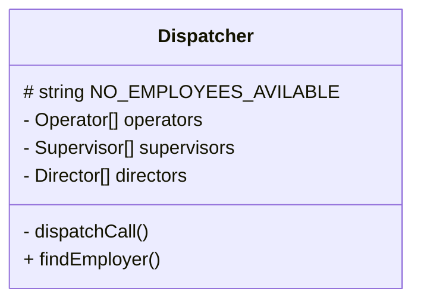
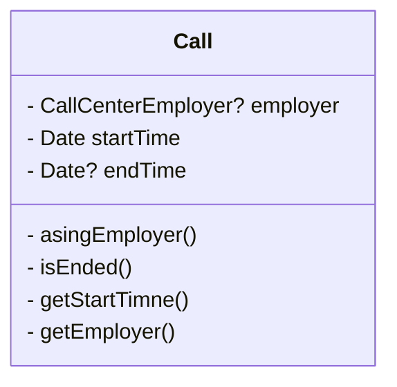
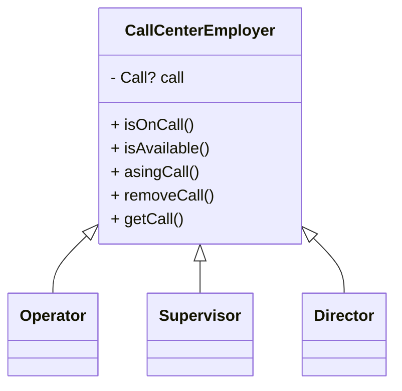

# Callcenter

## Diagrama de clases

```mermaid
classDiagram
    class Dispatcher
    Dispatcher: # string NO_EMPLOYEES_AVILABLE
    Dispatcher: - Operator[] operators
    Dispatcher: - Supervisor[] supervisors
    Dispatcher: - Director[] directors
    Dispatcher: - dispatchCall()
    Dispatcher: + findEmployer()

```

```mermaid
classDiagram
    class Call {
    - CallCenterEmployer? employer
    - Date startTime
    - Date? endTime
    - asingEmployer()
    - isEnded()
    - getStartTimne()
    - getEmployer()
    }
```

```mermaid
 classDiagram
      CallCenterEmployer <|-- Operator
      CallCenterEmployer <|-- Supervisor
      CallCenterEmployer <|-- Director
      CallCenterEmployer : - Call? call
      CallCenterEmployer: + isOnCall()
      CallCenterEmployer: + isAvailable()
      CallCenterEmployer: + asingCall()
      CallCenterEmployer: + removeCall()
      CallCenterEmployer: + getCall()
      class Operator{
      }
      class Supervisor{

      }
      class Director{
      }
```